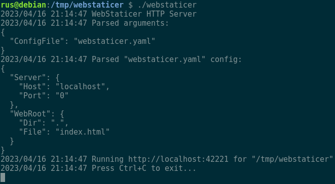

# WebStaticer
Small HTTP Server aimed to serve static files.



## Getting started

Tune `webstaticer.yaml` config file:
```yaml
server:
  host: localhost
  port: 0

webroot:
  dir: .
  file: index.html
```

If `server.port` is equal to `0` then random free TCP port will be used.

Server can be run with:
```text
./webstaticer <CONFIG_FILE>
```

where:
- `<CONFIG_FILE>` (optional) - path to config file, default is used if not specified.

## Development

### Requirements

- [Go](https://go.dev/dl/)
- [GNU Make](https://www.gnu.org/software/make/)

### Update dependencies
```text
go mod tidy && go mod vendor
```

### Build

To make a cross-build, please see available platforms:
```text
go tool dist list
```

For example, for linux run this command to create a binary file for `linux/amd64` architecture:
```text
GOOS=linux GOARCH=amd64 go build
```

For batch build use [Makefile](Makefile) and run:
```text
make build
```
It will be created `builds` directory with compiled binary files according to preconfigured set of platforms.
